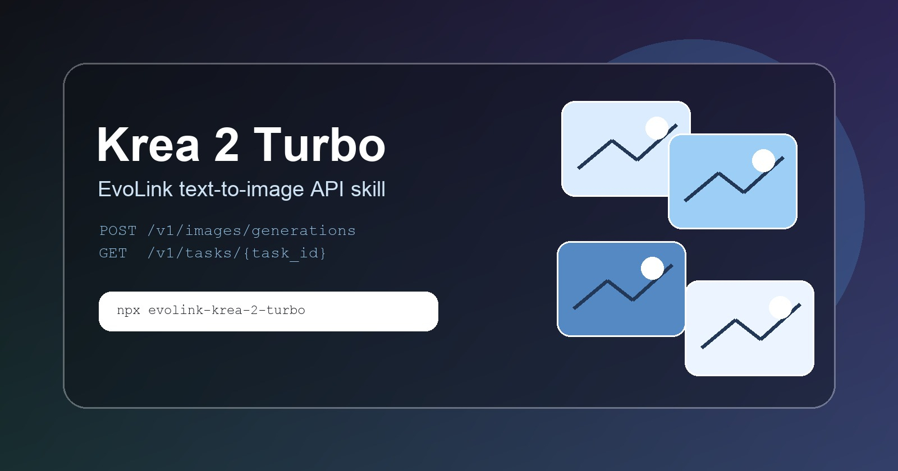

# Krea 2 Turbo Image Generation API Skill

<p align="center">
  <strong>Install an agent skill and run Krea 2 Turbo text-to-image generation through EvoLink.</strong>
</p>

<p align="center">
  <a href="https://docs.evolink.ai/en/api-manual/image-series/krea/krea-2-turbo-image-generate?utm_source=github&utm_medium=readme&utm_campaign=krea-2-turbo-image">
    
  </a>
</p>

<p align="center">
  <a href="https://www.npmjs.com/package/evolink-krea-2-turbo"></a>
  <a href="LICENSE"></a>
  <a href="https://github.com/Evolink-AI/krea-2-turbo-image-generate-api-skill/stargazers"></a>
  <a href="https://github.com/Evolink-AI/krea-2-turbo-image-generate-api-skill/commits/main/"></a>
</p>

<p align="center">
  <a href="#-menu">Menu</a> •
  <a href="#installation">Install</a> •
  <a href="#-showcase">Showcase</a> •
  <a href="#krea-2-turbo-image-generation">Krea 2 Turbo</a> •
  <a href="#getting-an-api-key">API Key</a> •
  <a href="https://evolink.ai/dashboard/keys?utm_source=github&utm_medium=readme&utm_campaign=krea-2-turbo-image">EvoLink</a>
</p>

<p align="center">
  <a href="README.md"></a>
  <a href="README.es.md"></a>
  <a href="README.pt.md"></a>
  <a href="README.ja.md"></a>
  <a href="README.ko.md"></a>
  <a href="README.de.md"></a>
  <a href="README.fr.md"></a>
  <a href="README.tr.md"></a>
  <a href="README.zh-TW.md"></a>
  <a href="README.zh-CN.md"></a>
  <a href="README.ru.md"></a>
</p>

---

> **AI Agent?** Skip the README, go straight to [**llms-install.md**](llms-install.md) for step-by-step installation instructions designed for agents.

---

<a id="menu"></a>

## 📑 Menu

- [Agent Skill](#agent-skill-first)
- [Installation](#installation)
- [Agent Auto-Install](#agent-auto-install)
- [Getting an API Key](#getting-an-api-key)
- [API Quick Start](#api-quick-start)
- [Full First-Run Flow](#full-first-run-flow)
- [API Reference](#api-reference)
- [Showcase](#showcase)
- [Troubleshooting](#troubleshooting)
- [Compatibility](#compatibility)
- [Community](#community)
- [License](#license)

---

<a id="agent-skill-first"></a>

## What is This?

Krea 2 Turbo is a fast text-to-image model for high-fidelity cinematic visuals. This repository packages the EvoLink API flow, runnable examples, and an installable agent skill in one npm package.

| Field | Value |
|---|---|
| Skill | Krea 2 Turbo Image Generation |
| Model | `krea-2-turbo` |
| Package | `evolink-krea-2-turbo` |
| Skill slug | `krea-2-turbo-image` |

---

<a id="installation"></a>

## Installation

### Quick Install (OpenClaw)

```bash
openclaw skills add https://github.com/Evolink-AI/krea-2-turbo-image-generate-api-skill
```

### Install via npm (Recommended)

```bash
npx evolink-krea-2-turbo@latest -y --path ~/.codex/skills
```

Other common targets:

```bash
npx evolink-krea-2-turbo@latest -y --path ~/.claude/skills
npx evolink-krea-2-turbo@latest -y --path ~/.openclaw/skills
npx evolink-krea-2-turbo@latest -y --path ~/.opencode/skills
```

### Manual Install

```bash
git clone https://github.com/Evolink-AI/krea-2-turbo-image-generate-api-skill.git
cd krea-2-turbo-image-generate-api-skill
npm install
node bin/cli.js -y --path ~/.codex/skills
```

<a id="agent-auto-install"></a>

### Agent Auto-Install

```text
Install the Krea 2 Turbo skill by running:

npx evolink-krea-2-turbo@latest -y --path ~/.codex/skills

Then read ~/.codex/skills/krea-2-turbo-image/SKILL.md and run a dry run before calling the real API.
```

---

<a id="getting-an-api-key"></a>

## Getting an API Key

Open the EvoLink key page, create or select an API key, paste it back into your agent, and save it as `EVOLINK_API_KEY`:

[Get an EvoLink API key](https://evolink.ai/dashboard/keys?utm_source=github&utm_medium=readme&utm_campaign=krea-2-turbo-image)

The installer prints the same key handoff as machine-readable lines:

```text
EVOLINK_KEY_URL=<installer-generated tracked key URL>
AGENT_NEXT_ACTION=open_key_url_then_collect_key
ENV_VAR_EXPORT=export EVOLINK_API_KEY=your_key_here
```

Verify the key through `GET /v1/credits`, a non-generating endpoint, before creating an image task.

---

<a id="api-quick-start"></a>

## API Quick Start

Create a task with `POST /v1/images/generations`, then poll `GET /v1/tasks/{task_id}`.

---

<a id="full-first-run-flow"></a>

## Full First-Run Flow

1. Validate `EVOLINK_API_KEY` with `GET /v1/credits`.
2. Submit `POST /v1/images/generations`.
3. Store the returned task `id`.
4. Poll `GET /v1/tasks/{task_id}`.
5. Return the first `results` URL to the user and remind them to save it within 24 hours.

---

<a id="api-reference"></a>

## API Reference

See [docs/api-reference.md](./docs/api-reference.md) for full request and response details.

---

<a id="showcase"></a>

## 🖼️ Showcase

| Prompt | Size | Result |
|---|---|---|
| Cinematic product poster with silver headphones | `16:9` | Polls until `RESULT_URL=<url>` |
| Clean studio product render of a compact camera | `1:1` | Dry-run safe validation |
| Minimalist architectural render at sunset | `3:2` | Optional `2K` quality |

---

## Krea 2 Turbo Image Generation

Run the API directly:

```bash
EVOLINK_API_KEY=your_key npx evolink-krea-2-turbo@latest "A cinematic product poster, silver headphones floating against a deep matte-black backdrop with soft rim lighting"
```

Create an asynchronous image generation task:

```bash
export EVOLINK_API_KEY="your_key_here"

curl --request POST \
  --url https://api.evolink.ai/v1/images/generations \
  --header "Authorization: Bearer ${EVOLINK_API_KEY}" \
  --header "Content-Type: application/json" \
  --header "X-EvoLink-Source: skill" \
  --header "X-EvoLink-Skill: krea-2-turbo-image" \
  --header "X-EvoLink-Package: evolink-krea-2-turbo" \
  --header "X-EvoLink-Campaign: krea-2-turbo-image" \
  --header "X-EvoLink-Touchpoint: first-call" \
  --data '{
    "model": "krea-2-turbo",
    "prompt": "A cinematic product poster, silver headphones floating against a deep matte-black backdrop with soft rim lighting",
    "size": "16:9",
    "quality": "1K",
    "nsfw_check": false
  }'
```

Poll the task until completion:

```bash
curl --request GET \
  --url https://api.evolink.ai/v1/tasks/{task_id} \
  --header "Authorization: Bearer ${EVOLINK_API_KEY}"
```

Generated image URLs are valid for 24 hours, so save them promptly.

See also:

- [Quickstart](./docs/quickstart.md)
- [API reference](./docs/api-reference.md)
- [Task lifecycle](./docs/task-lifecycle.md)
- [Response schema](./docs/response-schema.md)
- [Errors](./docs/errors.md)
- [Callbacks](./docs/callbacks.md)
- [Pricing notes](./docs/pricing.md)
- [Official EvoLink Krea 2 Turbo docs](https://docs.evolink.ai/en/api-manual/image-series/krea/krea-2-turbo-image-generate?utm_source=github&utm_medium=readme&utm_campaign=krea-2-turbo-image)

---

## File Structure

```text
.
├── SKILL.md
├── llms-install.md
├── bin/cli.js
├── scripts/krea-2-turbo-image.sh
├── docs/
├── examples/
├── references/
└── package.json
```

---

<a id="troubleshooting"></a>

## Troubleshooting

| Issue | Fix |
|---|---|
| Missing `EVOLINK_API_KEY` | Create a key from the dashboard link above and export it. |
| `401` or `403` | Validate the key with `GET /v1/credits`. |
| `402` | Add credits or lower test volume. |
| `429` | Reduce concurrency and retry with backoff. |
| `content_policy_violation` | Adjust the prompt to avoid disallowed or protected content. |
| Polling timeout | Keep the task ID; the task may still finish server-side. |

---

<a id="compatibility"></a>

## Compatibility

| Agent | Install method |
|---|---|
| Codex | `npx evolink-krea-2-turbo@latest -y --path ~/.codex/skills` |
| Claude Code | `npx evolink-krea-2-turbo@latest -y --path ~/.claude/skills` |
| OpenClaw | `openclaw skills add https://github.com/Evolink-AI/krea-2-turbo-image-generate-api-skill` |
| OpenCode | `npx evolink-krea-2-turbo@latest -y --path ~/.opencode/skills` |
| Cursor | `npx evolink-krea-2-turbo@latest -y --path ~/.cursor/skills` |

---

<a id="community"></a>

## Community

- Docs: https://docs.evolink.ai/en/api-manual/image-series/krea/krea-2-turbo-image-generate?utm_source=github&utm_medium=readme&utm_campaign=krea-2-turbo-image-generate-api-skill
- API keys: https://evolink.ai/dashboard/keys?utm_source=github&utm_medium=readme&utm_campaign=krea-2-turbo-image
- Issues: https://github.com/Evolink-AI/krea-2-turbo-image-generate-api-skill/issues
- npm: https://www.npmjs.com/package/evolink-krea-2-turbo

## Star History

Star history starts after the repository is published.

---

<a id="license"></a>

## License

MIT

<p align="center">Powered by EvoLink</p>
